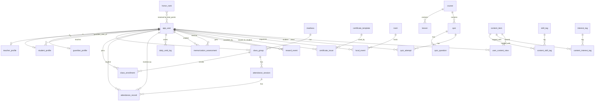

# Quranic Platform ERD

This ERD covers the core modules:
- User portals (`student`, `teacher`, `admin`, `guardian`)
- Attendance and memorization evaluations
- Points and honor ranking
- Certificates
- Room/event scheduling
- Micro-LMS (courses/quizzes)
- Smart content tagging and recommendations

## Notes

- Use `app_user.role` to control dashboard access and API permissions.
- `memorization_assessment.published_to_guardian` controls parent visibility.
- `student_points_summary` view computes gamification totals without duplicating data.
- `local_event` + `room` prevents scheduling conflicts at application level.
- Content recommendation can be built by matching viewed content tags with other content tags.
